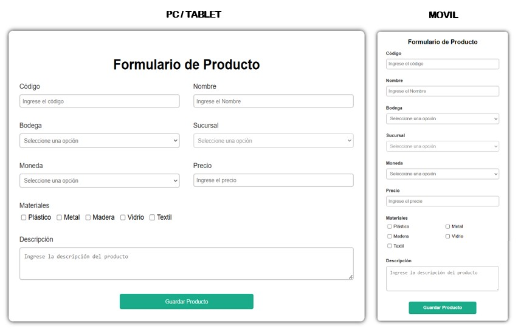
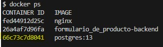
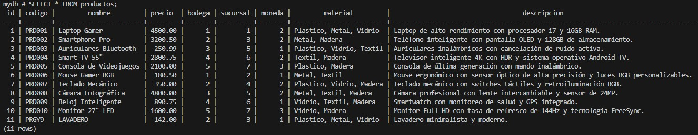
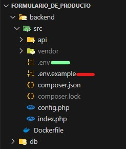

# **📌 SISTEMA DE REGISTRO DE PRODUCTOS**

## **📌 Descripción del Proyecto**
Este proyecto es un sistema web diseñado para la gestión de productos, desarrollado utilizando contenedores de **Docker**. Su propósito principal es permitir a los usuarios agregar productos a una base de datos, garantizando validaciones en tiempo real y asegurando la persistencia de los datos.  

La aplicación se basa en una arquitectura **cliente-servidor**, donde el **frontend**, el **backend** y la **base de datos** están separados en contenedores independientes, proporcionando un entorno escalable, modular y fácilmente desplegable.



---

## **📌 Instalación de Docker**
Para ejecutar el proyecto, es necesario tener **Docker** y **Docker Compose** instalados en tu sistema.  

### **1️⃣ Instalar Docker**
#### 🔹 En **Ubuntu/Linux**
```sh
sudo apt update
sudo apt install docker.io
```
#### 🔹 En **MacOS / Windows**
Descarga Docker desde [aquí](https://www.docker.com/get-started) y sigue las instrucciones de instalación.

### **2️⃣ Instalar Docker Compose**
#### 🔹 En **Ubuntu/Linux**
```sh
sudo curl -L "https://github.com/docker/compose/releases/latest/download/docker-compose-$(uname -s)-$(uname -m)" -o /usr/local/bin/docker-compose
sudo chmod +x /usr/local/bin/docker-compose
```
#### 🔹 En **MacOS / Windows**
Docker Compose ya está incluido en la instalación estándar de Docker.

---

## **📌 Arquitectura del Proyecto**
El sistema se compone de **tres contenedores Docker** que trabajan juntos:  

| Contenedor  | Función |
|------------|---------|
| `db` (PostgreSQL)  | Contiene la base de datos que almacena los productos. |
| `backend` (PHP) | API que maneja las peticiones y la lógica de validación. |
| `frontend` (NGINX) | Interfaz de usuario que permite interactuar con el sistema. |

### **Ventajas de esta Arquitectura con Docker**
✔ **Aislamiento**: Cada servicio (frontend, backend y base de datos) corre en su propio entorno sin interferir con el sistema anfitrión.  
✔ **Escalabilidad**: Se pueden agregar más instancias fácilmente si aumenta la demanda.  
✔ **Portabilidad**: Todo el entorno de desarrollo puede ser ejecutado en cualquier sistema con Docker instalado.  
✔ **Despliegue fácil**: La configuración con `docker-compose.yml` permite levantar todo con un solo comando.

---

## **📌 Configuración y Despliegue**
Para iniciar el sistema, abre "Docker Desktop" y en el terminal de la pc ejecuta:

```sh
docker-compose up --build
```
Esto descargará las imágenes necesarias, configurará los contenedores y dejará la aplicación lista para su uso.

Si deseas detener los contenedores:

```sh
docker-compose down
```

---

## **📌 Tecnologías y Versiones Utilizadas**
El proyecto está basado en las siguientes herramientas:

| Tecnología | Versión |
|------------|---------|
| **PostgreSQL** | 13 |
| **PHP** | 7.4 |
| **NGINX** | Última versión disponible |
| **Docker** | 3.8 |
| **Docker Compose** | Última versión disponible |
| **JavaScript (Frontend)** | ES6+ |

---

## **📌 Flujo de Guardado de un Producto en la Base de Datos**
### **🔹 ¿Qué sucede cuando se guarda un producto?**
1. **El usuario llena el formulario** y presiona el botón **"Guardar Producto"**.
2. **El frontend (JavaScript) envía los datos al backend (PHP) usando `fetch`**.
3. **El backend recibe la petición, valida los datos y verifica que el código no se repita**:
   - Si falta algún campo o el código ya existe, devuelve un error.
   - Si todo es válido, los datos se insertan en la base de datos.
4. **El backend responde con éxito** y el frontend muestra un mensaje al usuario.
5. **El formulario se limpia** y la validación se restablece.

---

## **📌 Base de Datos**
La base de datos está gestionada en **PostgreSQL** y contiene una tabla principal:

```sql
CREATE TABLE IF NOT EXISTS productos (
    id SERIAL PRIMARY KEY,
    codigo VARCHAR(15) UNIQUE NOT NULL,
    nombre VARCHAR(50) NOT NULL,
    precio DECIMAL(10,2) NOT NULL,
    bodega INT NOT NULL,
    sucursal INT NOT NULL,
    moneda INT NOT NULL,
    descripcion TEXT NOT NULL,
    material TEXT NOT NULL
);
```

---

## **📌 Acceso a PostgreSQL desde la Terminal**
Si deseas consultar los productos almacenados en la base de datos, sigue estos pasos:

### **1️⃣ Ingresar al contenedor de PostgreSQL**
Ejecuta el siguiente comando para acceder a PostgreSQL dentro de Docker:

**Visualizar nombre del contenedor:**
```sh
docker ps
```

Copiar el número del "CONTENEDOR_ID" de Postgres:



Se debe reemplazar "nombre_del_contenedor" por el número que representa el nombre del contenedor PostgreSQL en el siguiente comando:

```sh
docker exec -it nombre_del_contenedor psql -U myuser -d mydb
```

### **2️⃣ Ver las tablas disponibles**
```sql
\dt
```

### **3️⃣ Ver todos los productos almacenados**
```sql
SELECT * FROM productos;
```

### **4️⃣ Contar el total de productos**
```sql
SELECT COUNT(*) FROM productos;
```



### **5️⃣ Salir de PostgreSQL**
```sql
\q
```

---

## **📌 Buenas Prácticas Implementadas**
### **🔹 Uso de Variables de Entorno**
- Se definieron en `backend/src/.env` para configurar credenciales de la base de datos sin exponerlas en el código fuente.

Antes de ejecutar el proyecto, asegúrate de configurar correctamente las variables de entorno.  
Para ello, renombra el archivo **`.env.example`** a **`.env`** ejecutando el siguiente comando:

```sh
cp backend/src/.env.example backend/src/.env
```

Después de esto, edita el archivo **`.env`** y configura los valores adecuados para la conexión a la base de datos. (Como este es un proyecto de ejemplo, el .env.example ya tiene los valores correctos).



### **🔹 Validaciones en Backend**
- Verificación de que todos los campos requeridos estén presentes antes de insertar un producto.
- Validación de código único antes de permitir un nuevo registro.
- Manejo adecuado de errores HTTP (`400 Bad Request`, `500 Internal Server Error`).

### **🔹 Optimización de Código**
- **Uso de transacciones en PostgreSQL** para garantizar la integridad de los datos.
- **Modularización del código en PHP y JavaScript** para mejorar la mantenibilidad.
- **Uso de `async/await` en el frontend** para manejar peticiones de forma eficiente.

### **🔹 Seguridad**
- **Configuración de CORS** para permitir comunicación entre frontend y backend sin vulnerabilidades.
- **Uso de `bindParam` en SQL para prevenir inyección SQL**:
```php
$stmt->bindParam(":codigo", $codigo);
```

---